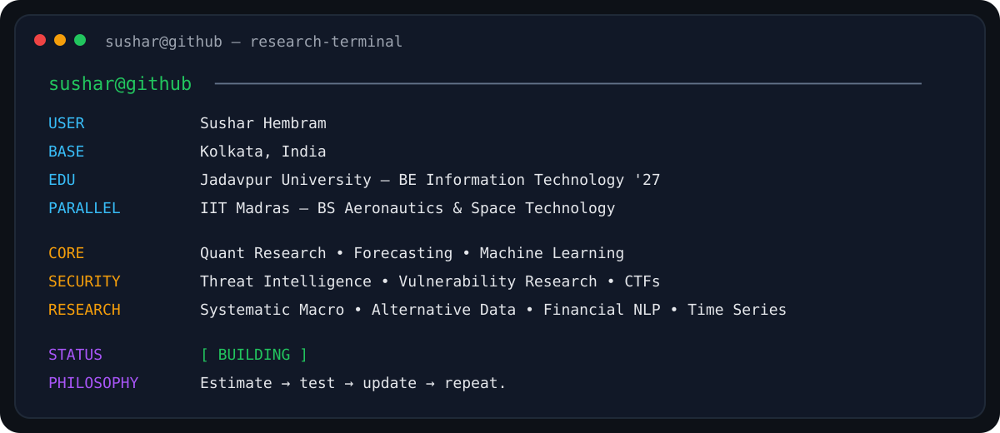
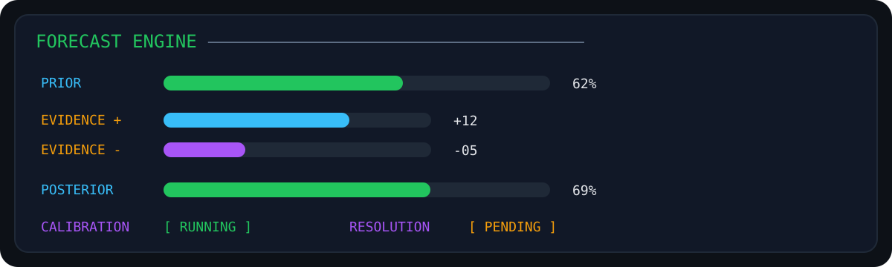

<!--
===============================================================================
  SUSHAR HEMBRAM — GITHUB PROFILE README
  github.com/UNKN0WN006
===============================================================================
-->

<div align="center">


<br>

<code>researching uncertain systems — from markets to machines</code>

<br><br>

<a href="https://github.com/UNKN0WN006">
  
</a>
<a href="https://github.com/UNKN0WN006?tab=followers">
  
</a>
<a href="https://github.com/UNKN0WN006?tab=repositories">
  
</a>

<br><br>

<a href="https://linkedin.com/in/susharhembram">
  
</a>
<a href="mailto:hembramsushar@gmail.com">
  
</a>
<a href="https://medium.com/@hembramsushar">
  
</a>

</div>

---

## 🖥️ `sushar@research-terminal:~$ whoami`

<div align="center">
  
</div>

---

## 🧭 Research Coordinates

<div align="center">


</div>

---

## 👋 About Me

```python
class SusharHembram:
    education = "Jadavpur University · IT '27"

    research = [
        "Quantitative Research",
        "Forecasting",
        "Machine Learning",
        "Security Research"
    ]

    interests = [
        "Systematic Macro",
        "Alternative Data",
        "Financial NLP",
        "Threat Intelligence"
    ]

    long_game = "Aerospace & Scientific Systems"

    philosophy = "Estimate → test → update → repeat."
```

I like problems where information is incomplete, environments change, signals are noisy, and the useful answer is rarely just **yes** or **no**.

I am especially interested in:

$$
P(\text{outcome}\mid\text{evidence})
$$

and in asking:

> **What is the probability? What evidence would change it? How much confidence should we place in the estimate?**

---

## 🔭 Current Radar

<table>
<tr>
<td width="50%" valign="top">

### 📈 Quantitative Research

- probabilistic forecasting
- systematic macro
- financial time series
- signal research
- alternative data
- market behaviour
- forecast calibration

</td>
<td width="50%" valign="top">

### 🛡️ Security Research

- vulnerability research
- threat intelligence
- CTF / security labs
- attack classification
- reverse engineering
- adversarial systems
- security engineering

</td>
</tr>

<tr>
<td width="50%" valign="top">

### 🧠 Machine Learning / NLP

- text summarisation
- financial NLP
- few-shot learning
- representation learning
- forecasting models
- model evaluation
- pattern recognition

</td>
<td width="50%" valign="top">

### 🚀 Scientific Systems

- aeronautics
- spacecraft systems
- control systems
- simulation
- scientific computing
- autonomous systems

</td>
</tr>
</table>

---

# 🔬 Featured Research & Projects

<table>
<tr>
<td width="50%" valign="top">

## 🌍 Permissioned Economy

**Macro Forecasting · Geoeconomics · AI Infrastructure**

Forecasting research developed for **Bridgewater × Global Citizen — Forecasting the Future 2026**.

**20 probabilistic forecasts · 2026–2031**

Research themes:

- AI compute infrastructure
- electricity and data-centre demand
- semiconductor policy
- critical minerals
- global trade and tariffs
- maritime infrastructure
- reserve currencies
- global macro transitions

**Methods**

`Probability Estimation` `Base Rates` `Scenario Analysis` `Resolution Criteria` `Evidence Tracking` `Forecast Updating`

[](https://github.com/UNKN0WN006?tab=repositories)

</td>

<td width="50%" valign="top">

## 🕸️ Maayavapi

**AI-Powered Threat Intelligence Platform**

SSH honeypot + attack-intelligence system for real-time hostile-activity analysis.

**Capabilities**

- command analytics
- attack classification
- IP reputation enrichment
- geographic threat mapping
- behavioural analysis
- rule-based alerts

**Stack**

`Python` `React` `TypeScript` `Supabase`

[](https://github.com/UNKN0WN006?tab=repositories)

</td>
</tr>

<tr>
<td width="50%" valign="top">

## 🧬 NOESIS

**Nested Orchestration of Exploitability & Structure Insight System**

Repository-security intelligence for analysing software architecture and reasoning about exploitability.

**Analyses**

- authentication
- authorization
- dependencies
- trust boundaries
- data flow
- repository architecture

**Stack**

`FastAPI` `Python` `GitHub API` `Next.js`

[](https://github.com/UNKN0WN006?tab=repositories)

</td>

<td width="50%" valign="top">

## 🎥 Few-Shot Multimedia Classification

**🥉 3rd Place — COMSYS Hackathon IV**

Few-shot multimedia classification using deep visual representations and temporal modelling.

**Selected video accuracy: 0.818**

Research areas:

- ResNet50 feature extraction
- LRCN architecture
- few-shot learning
- meta-learning
- multimodal experimentation

`PyTorch` `TensorFlow` `Computer Vision`

[](https://github.com/UNKN0WN006?tab=repositories)

</td>
</tr>
</table>

---

## 🧱 Currently Building

<div align="center">

| Project / Research Track | Focus | Status |
|---|---|---|
| 📊 **Macro Forecasting Lab** | Inflation · Rates · GDP · Energy · FX |  |
| 🎯 **Forecast Calibration Lab** | Brier Score · Probability Updates · Resolution Tracking |  |
| 📰 **Financial NLP** | Policy · Central Banks · Events · Market Response |  |
| 🛡️ **Cyber Risk Event Study** | Security Incidents → Market Impact |  |
| 📈 **SignalForge** | Signal Hypothesis · Backtesting · Robustness |  |
| 🚀 **Scientific Systems** | Aerospace · Control · Simulation |  |

</div>

> `research mode:` **hypothesis → evidence → experiment → evaluation → revision**

---

## 🎯 Forecasting Laboratory

I treat forecasting as an iterative research process rather than a one-time prediction.

<div align="center">

### `BASE RATE → PRIOR → EVIDENCE → UPDATE → RESOLUTION → CALIBRATION`

<br>


<br><br>


</div>

<br>

<div align="center">
  
</div>

---

## 🛡️ Security Operations

```text
                        INTERNET
                           │
                           ▼
                  ┌─────────────────┐
                  │ Reconnaissance  │
                  └────────┬────────┘
                           │
                           ▼
                  ┌─────────────────┐
                  │ Attack Surface  │
                  └────────┬────────┘
                           │
                           ▼
                  ┌─────────────────┐
                  │ Vulnerability   │
                  │    Research     │
                  └────────┬────────┘
                           │
                           ▼
                  ┌─────────────────┐
                  │ Exploitability  │
                  └────────┬────────┘
                           │
                           ▼
                  ┌─────────────────┐
                  │ Threat Intel    │
                  └────────┬────────┘
                           │
                           ▼
                  ┌─────────────────┐
                  │ Detection / IR  │
                  └─────────────────┘
```

<div align="center">


</div>

`OWASP` · `Vulnerability Research` · `Threat Intelligence` · `OSINT` · `Reverse Engineering` · `Incident Analysis` · `Penetration Testing` · `Linux Security`

---

## 🏆 Proof of Work

| | Achievement | Domain |
|---|---|---|
| 🥉 | **3rd Place — COMSYS Hackathon IV** | Few-shot multimedia classification |
| 🏆 | **Top 3 — Google SecOps MCP Challenge** | Security automation |
| 🌍 | **Forecasting the Future 2026 — Bridgewater × Global Citizen** | Macro / probabilistic forecasting |
| 🔭 | **2,800+ NASA citizen-science classifications** | Scientific data analysis |
| 🛡️ | **HackerOne & Intigriti research** | Vulnerability research |
| 🎓 | **Google Cybersecurity Professional Certificate** | Cybersecurity |
| 💡 | **Eureka! Junior Semifinalist — IIT Bombay** | Entrepreneurship |
| 🚀 | **IIT Madras Aeronautics & Space Technology** | Aerospace systems |

---

# ⚔️ Technical Arsenal

## `01 // Languages`

<div align="center">


</div>

## `02 // Quant • Data • Machine Learning`

<div align="center">


</div>

## `03 // Engineering`

<div align="center">


</div>

## `04 // Security`

<div align="center">


</div>

---

## 🌐 Research & Competition Platforms

<div align="center">


</div>

---

## 📊 GitHub Command Centre

<div align="center">


</div>

<br>

<div align="center">


</div>

---

## 📈 Activity Telemetry

<div align="center">


</div>

---

## 🧬 Contribution DNA

<div align="center">


</div>

---

## 🏅 Trophy Cabinet

<div align="center">


</div>

---

## 🎮 `github.exe`

```text
┌──────────────────────────────────────────────────────────┐
│                                                          │
│             CONTRIBUTION ENGINE ONLINE                   │
│                                                          │
│    ░ ▓ ▓ ░ ▓▓▓ ░ ▓ ▓▓ ░░ ▓▓▓▓ ░▓▓ ▓ ░▓▓               │
│                                                          │
│              🐍  CONSUME COMMITS                         │
│                                                          │
│       BUILD → BREAK → RESEARCH → REBUILD                 │
│                                                          │
│   RESEARCH ████████████████░░░      ACTIVE               │
│   COFFEE   ████████████████████     100%                 │
│   CURIOSITY████████████████████     100%                 │
│                                                          │
└──────────────────────────────────────────────────────────┘
```

---

## 🌌 Outside the Terminal

<table>
<tr>
<td width="25%" align="center">

### 📚 Research

Forecasting  
Quantitative Finance  
Machine Learning  
Security

</td>
<td width="25%" align="center">

### 🚀 Space

Aeronautics  
Space Systems  
Control  
Scientific Computing

</td>
<td width="25%" align="center">

### 🛡️ Cyber

CTFs  
Bug Bounty  
Threat Intelligence  
Reverse Engineering

</td>
<td width="25%" align="center">

### ☕ Life

Coffee  
Science Fiction  
Systems  
Building Things

</td>
</tr>
</table>

---

## 🗺️ The Long Game

```text
                           UNCERTAINTY
                               │
              ┌────────────────┼────────────────┐
              │                │                │
              ▼                ▼                ▼
        FORECASTING        SECURITY         SCIENCE
              │                │                │
              ▼                ▼                ▼
           MARKETS          SYSTEMS         AEROSPACE
              │                │                │
              └────────────────┼────────────────┘
                               │
                               ▼
                       DECISION SYSTEMS
```

My interests may look broad at first glance, but they orbit a common problem:

> **How do we understand, predict and engineer complex systems under uncertainty?**

---

## 📡 Establish Connection

<div align="center">

<a href="mailto:hembramsushar@gmail.com">

</a>

<a href="https://linkedin.com/in/susharhembram">

</a>

<a href="https://github.com/UNKN0WN006">

</a>

<a href="https://medium.com/@hembramsushar">

</a>

<br><br>

### `Life orbiting around rockets, algorithms and coffee.`

**prediction · evidence · markets · security · systems · space**

<br>


</div>
