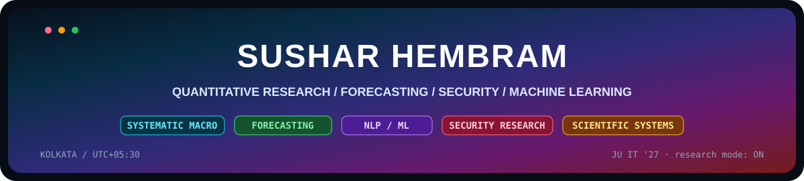
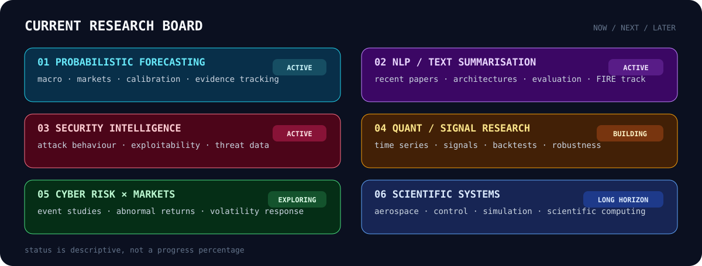
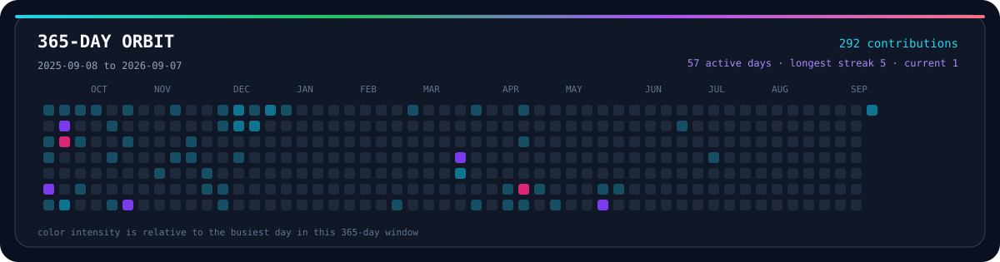
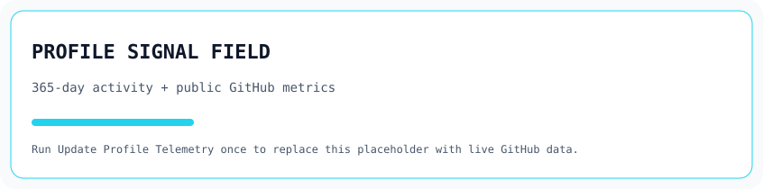
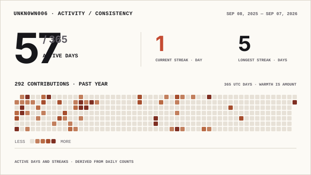
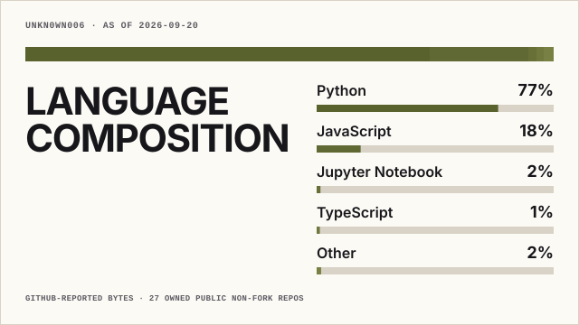

<!-- SUSHAR HEMBRAM — GitHub Profile -->

<div align="center">
  
</div>

<div align="center">

[](https://github.com/UNKN0WN006)
[](https://github.com/UNKN0WN006?tab=followers)
[](https://github.com/UNKN0WN006?tab=repositories)

[](https://linkedin.com/in/susharhembram)
[](mailto:hembramsushar@gmail.com)
[](https://medium.com/@hembramsushar)

</div>

---

## `00 // identity`

<div align="center">
  
</div>

I work on **forecasting, quantitative research, machine learning and security systems** — especially problems where the data is noisy, the environment changes, and confidence matters as much as the answer.

Most of that can be reduced to one question:

<div align="center">

### `P(outcome | evidence)`

**Given the evidence available now, what should I believe — and what would make me change my mind?**

</div>

---

## `01 // current research`

<div align="center">
  
</div>

<sub>The board separates work I am actively doing from research I am building toward. I would rather show a small honest pipeline than label every interest as “in progress.”</sub>

---

## `02 // selected work`

<table>
<tr>
<td width="50%" valign="top">

### Permissioned Economy
**macro forecasting / geoeconomics**

Forecasting research developed for **Bridgewater × Global Citizen — Forecasting the Future 2026**.

`20 binary forecasts` · `2026–2031`

**Questions I worked around**
- AI compute and data-centre infrastructure
- electricity and grid constraints
- semiconductors and critical minerals
- trade policy and tariffs
- maritime infrastructure
- FX reserves and global macro transitions

**Method**
`base rates` `scenario analysis` `resolution rules` `evidence updates`

[](https://github.com/UNKN0WN006?tab=repositories)

</td>
<td width="50%" valign="top">

### Maayavapi
**threat intelligence / attacker behaviour**

AI-assisted SSH honeypot and threat-intelligence system for turning hostile sessions into structured signals.

**Built around**
- command and session telemetry
- attack classification
- IP reputation enrichment
- geographic threat mapping
- behavioural analysis
- rule-based alerting

`Python` `React` `TypeScript` `Supabase`

[](https://github.com/UNKN0WN006?tab=repositories)

</td>
</tr>

<tr>
<td width="50%" valign="top">

### NOESIS
**repository security intelligence**

**Nested Orchestration of Exploitability & Structure Insight System**

Repository-analysis system that reasons across:
- authentication
- authorization
- dependencies
- trust boundaries
- data flow
- architectural exploitability

`Python` `FastAPI` `GitHub API` `Next.js`

[](https://github.com/UNKN0WN006?tab=repositories)

</td>
<td width="50%" valign="top">

### Few-Shot Multimedia Classification
**computer vision / meta-learning**

**3rd Place — COMSYS Hackathon IV**

Worked on few-shot video classification using deep visual representations and temporal modelling.

**Selected result:** `0.818 video accuracy`

`ResNet50` `LRCN` `Few-Shot Learning` `Meta-Learning`

[](https://github.com/UNKN0WN006?tab=repositories)

</td>
</tr>
</table>

---

## `03 // forecast lab`

I treat forecasting as a loop, not a one-shot prediction:

<div align="center">


<br>


</div>

<br>

<div align="center">
  
</div>

<sub>The values in the panel above are illustrative; the workflow is the important part. Public forecasting work is tracked separately from confidential platforms.</sub>

---

## `04 // security`

<table>
<tr>
<td width="56%" valign="top">

**My security loop**

`recon → attack surface → vulnerability → exploitability → threat intelligence → response`

<br>


</td>
<td width="44%" valign="top">

**Platforms / practice**


`OWASP` `OSINT` `Linux` `Penetration Testing`

</td>
</tr>
</table>

---

## `05 // proof of work`

| Signal | Evidence |
|---|---|
| **COMSYS Hackathon IV** | 3rd Place · few-shot multimedia classification |
| **Google SecOps MCP Challenge** | Top 3 · security automation |
| **Forecasting the Future 2026** | 20-outcome macro / geopolitical forecasting submission |
| **NASA citizen science** | 2,800+ astronomical classifications |
| **HackerOne + Intigriti** | vulnerability research / security challenges |
| **Google Cybersecurity Professional Certificate** | completed professional certificate |
| **Eureka! Junior — IIT Bombay** | semifinalist |

---

## `06 // toolchain`

<div align="center">

**languages**


**quant / data / ML**


**systems / engineering**


</div>

---

## `07 // 365-day orbit`

A **self-hosted 365-day contribution field**, generated from my real GitHub contribution calendar:

<div align="center">
  
</div>

<sub>Generated by `.github/workflows/orbit.yml` and refreshed automatically.</sub>

---

## `08 // profile telemetry`

These cards are generated inside this repository instead of depending on a live third-party image host.

<div align="center">

<picture>
  <source media="(prefers-color-scheme: dark)" srcset="./profile/signal-field-wide-dark.svg">
  
</picture>

<br>

<picture>
  <source media="(prefers-color-scheme: dark)" srcset="./profile/activity-consistency-wide-dark.svg">
  
</picture>

<br>

<picture>
  <source media="(prefers-color-scheme: dark)" srcset="./profile/language-composition-wide-dark.svg">
  
</picture>

</div>

---

## `09 // platforms`

<div align="center">


</div>

---

## `10 // long game`

```text
                     uncertainty
                         │
        ┌────────────────┼────────────────┐
        │                │                │
    forecasting       security         science
        │                │                │
      markets          systems        aerospace
        │                │                │
        └────────────────┼────────────────┘
                         │
                 decision systems
```

> **How do we understand, predict and engineer complex systems when the world refuses to stay still?**

---

## `11 // outside the terminal`

`quant research` · `cybersecurity` · `aeronautics` · `science fiction` · `coffee` · `strange systems worth building`

<div align="center">

[](mailto:hembramsushar@gmail.com)
[](https://linkedin.com/in/susharhembram)
[](https://github.com/UNKN0WN006)
[](https://medium.com/@hembramsushar)

<br><br>

### `Life orbiting around rockets, algorithms and coffee.`

</div>
